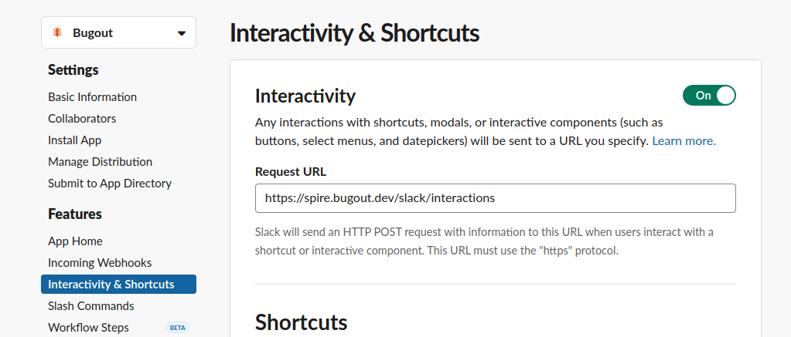
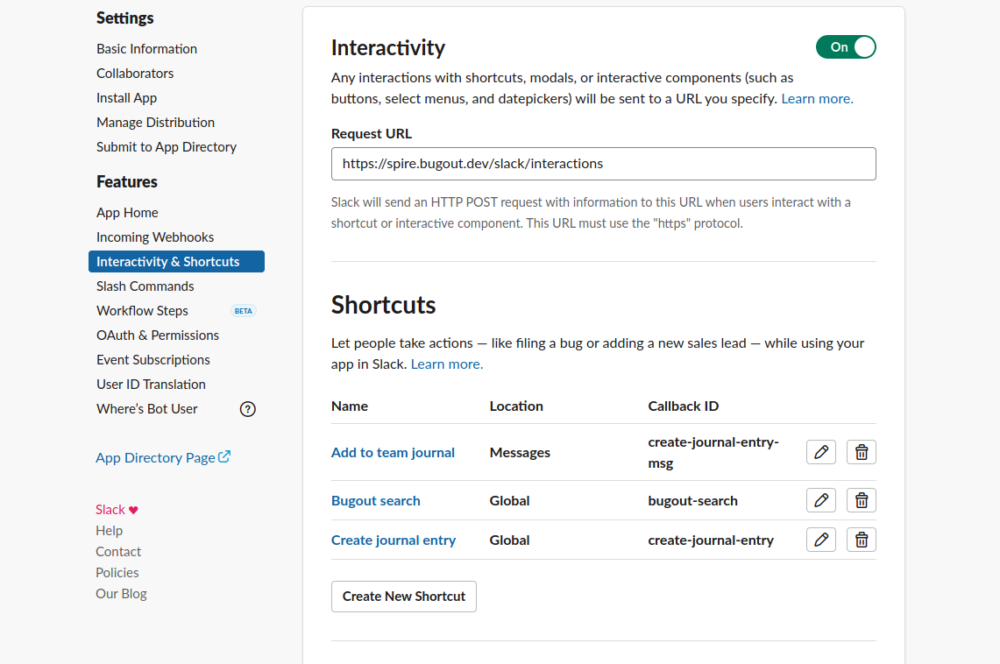
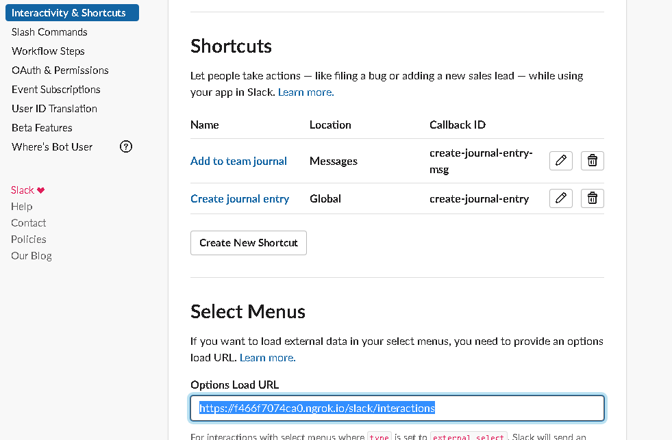

# Slack shortcuts

Slack reference on shortcuts: https://api.slack.com/interactivity/shortcuts

## Global shortcut: Bugout search

Users have the ability to search Bugout from their Slack workspaces by using a "Search using Bugout"
global shortcut.

**This feature is only accessible in Bugout Slack version 3 and higher.**

### Setup

Make sure the Slack application has the `commands` OAuth scope.

Make sure Bugout installation is at [version 3](./upgrades/version_3.py). To get it there:

```
python -m spire.slack.upgrades.version_3 -w <SLACK_WORKSPACE_ID>
```

(You can view all installations of your bot using `python -m spire.slack.installations`. This will
also return workspace IDs.)

Turn on interactivity for your app and register an interactions URL:



Add the following global shortcuts in your app:

```
Search                  Global      bugout-search
Add to team journal     Messages    create-journal-entry-msg
Create journal entry    Global      create-journal-entry
```

This is what the screen should look like in your Slack application management dashboard:



Make sure the text describing each shortcut (not pictured here) is appropriate to the function of
the shortcut.

Next need provide endpoint for external select options for it push same interactions URL as for shortcuts to **Select Menus** inside interaction settings.

 
